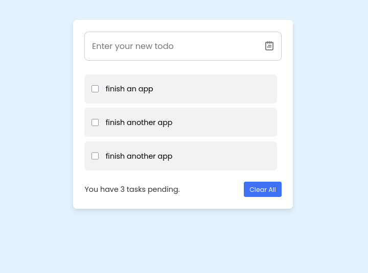

# Dynamic Todo List Application

> A functional task management app built with HTML, CSS, and vanilla JavaScript — one of my first projects where JavaScript actually worked.

---

## Introduction

This is an early-stage JavaScript project built during my frontend learning journey. Unlike my previous layout-only exercises, this project is **fully functional** — tasks can be added, completed, deleted, and cleared. It was a meaningful step forward: the first time I built something interactive that responded to real user input.

It is not a complex application. There is no database, no local storage, and no frameworks. But it works — and at the time I built it, that mattered.

---

## Live Demo

[yeabtsega-tesfaye.github.io/ToDo-List-app](https://yeabtsega-tesfaye.github.io/ToDo-List-app/)

---

## Learning Context

This project was built during the **Ethio Coders / Udacity** frontend learning program as a hands-on JavaScript challenge. The goal was to go beyond static HTML and CSS and start writing code that actually responded to the user — handling events, manipulating the DOM, and managing simple application state.

---

## Technologies Used

- HTML5
- CSS3
- Vanilla JavaScript (no frameworks, no libraries)

---

## What the App Does

- Type a task in the textarea and press **Enter** to add it to the list
- Click a task to **toggle its completion status** (checkbox checks/unchecks, pending count updates)
- Click the **trash icon** on any task to delete it individually
- Click **Clear All** to remove every task at once
- A live **pending task counter** displays how many tasks are still incomplete — showing "no" when all tasks are done or the list is empty
- The **Clear All** button is visually disabled (pointer-events: none) when the list is empty

---

## What the Code Actually Does

Looking at the JavaScript honestly:

- **DOM selection** is done once at the top using `document.querySelector` — a clean pattern even by current standards
- Tasks are added by **injecting an HTML string** via `insertAdjacentHTML` — functional, but it means the task content is inserted as raw HTML, which would be a security concern (XSS) in a real-world app
- The **`allTasks()` function** is the central state updater — it recounts pending tasks and toggles UI behavior every time a task is added, checked, or deleted. It is called after every user action
- **Completion toggling** works by toggling a `pending` CSS class on the `<li>` element and flipping the checkbox state manually — rather than relying on the checkbox's native behavior
- **Deletion** uses `e.parentElement.remove()` — simple and direct, though it depends on a specific DOM structure that would break if the HTML changed
- There is **no localStorage** — all tasks are lost on page refresh
- The `trim()` function is used on input to prevent adding blank or whitespace-only tasks — a small but thoughtful detail

---

## Screenshot



```

*A functional vanilla JavaScript todo app — add tasks with Enter, check them off, delete individually or clear all at once.*

---

## Current Project Status

**Complete for its intended scope.**

The app does everything it was designed to do. It has no persistent storage and no backend, which are natural limitations for a project at this stage — not oversights.

---

## Lessons Learned

- **`insertAdjacentHTML` is convenient but not safe for user input in production.** Inserting raw HTML strings from user-typed values opens the door to XSS (Cross-Site Scripting) attacks. The safer approach is to create DOM elements with `document.createElement` and set `textContent` directly. I didn't know this at the time.
- **Manually toggling a checkbox's checked state is unnecessary.** Clicking the `<li>` and then flipping `checkbox.checked` by hand works, but it fights against the browser's native checkbox behavior rather than using it.
- **No localStorage means no persistence.** Every page refresh wipes the list. Adding `localStorage.setItem` and `localStorage.getItem` would have made this dramatically more useful with very little extra code.
- **A single state-update function (`allTasks`) called after every action is a sound pattern.** It's a simplified version of the same thinking behind React's render cycle — keep the UI in sync with the data after every change. Getting this instinct early was genuinely valuable.
- **Getting something interactive working is a different kind of confidence than getting something to look right.** This project was the first time I felt like I was writing code that *did* something, not just code that *looked* like something.

---

## Ideas for Future Improvement

*(Not planned for this repo — listed as a learning reference)*

- Replace `insertAdjacentHTML` with `document.createElement` + `textContent` to prevent XSS
- Add `localStorage` so tasks survive a page refresh
- Add task editing — double-click a task to modify its text
- Add task categories or priority levels
- Make the UI responsive for smaller screens
- Add subtle animations when tasks are added or removed

---

## Reflection

This project sits at a clear boundary in my learning timeline. Before it, I was building things that looked like interfaces. With this project, I started building things that behaved like them.

The JavaScript is imperfect — there are security considerations I wasn't aware of, native browser behaviors I worked around unnecessarily, and missing features like persistence that would have made it genuinely useful. But the core logic works, the code is organized, and the thinking behind it — one central update function, clean DOM selection, trimming user input — shows early instincts that were worth developing.

Two years later, I am a third-year Software Engineering student studying data structures and algorithms, learning React, and working on real client projects. Looking back at this code, I can see both how far I've come and exactly where some of my current habits were first formed.

---

## Author

**Yeabtsega Tesfaye**
Software Engineering Student — Woldia University, Ethiopia
[GitHub Profile](https://github.com/Yeabtsega-Tesfaye)
